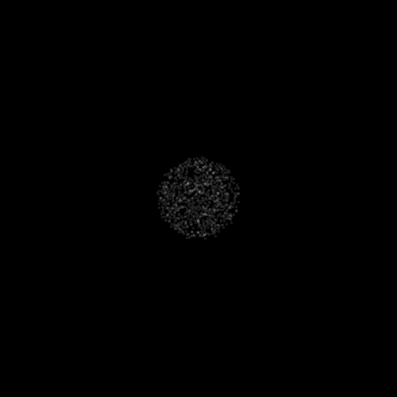
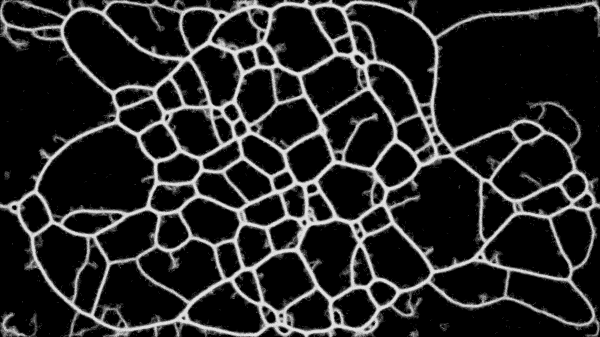

# Slime simulation
After watching [Sebastian Lague's video](https://www.youtube.com/watch?v=X-iSQQgOd1A&ab_channel=SebastianLague) about ant and slime simulation I wrote a similar implementation in Python. His video shows some really awesome results, especially the larger scale simulations (2560x1440 pixel map with 1M agents). 

Each agent moves and during movement it leaves a trail. An agent may turn if its sensors detect a trail, see [Sage Jenson's page](https://sagejenson.com/physarum) for a nice diagram of steps of a simulation tick and more cool results.

### 500x500 with 1024 agents

### 500x500 with 4096 agents

### Single frame of 1920x1080 with 262k agents

## References
- https://www.youtube.com/watch?v=X-iSQQgOd1A&ab_channel=SebastianLague
- https://sagejenson.com/physarum

